## Отчет по лабораторной работе № 2

#### № группы: `ПМ-2402`

#### Выполнил: `Павлов Максим Витальевич`

#### Вариант: `18`

### Cодержание:

- [Постановка задачи](#1-постановка-задачи)
- [Входные и выходные данные](#2-входные-и-выходные-данные)
- [Выбор структуры данных](#3-выбор-структуры-данных)
- [Алгоритм](#4-алгоритм)
- [Программа](#5-программа)
- [Анализ правильности решения](#6-анализ-правильности-решения)

### 1. Постановка задачи

> Напишите программу на Java, которая выполняет следующие действия с одномерным массивом натуральных чисел, включая проверку чисел на простоту:
> 1. Считывает с консоли число N, затем N целых чисел и заполняет массив размером N.
> 2. Переставляет элементы массива таким образом, чтобы сначала располагались все простые числа в порядке возрастания, затем все составные числа в порядке убывания. Если числа имеют одинаковый статус (оба простые или оба составные), сортирует их по соответствующему порядку.
> 3. Находит и выводит количество простых чисел в массиве.
> 4. Выводит элементы массива, заменяя простые числа на слово «Простое», а составные числа на слово «Составное».
> 5. Заменяет каждое число в массиве на сумму его цифр и выводит полученный массив.

Требуется написать программу, выполняющую ряд операций над одномерным массивом натуральных чисел. Она должна заполнять массив указанного размера, переставлять его элементы определенным образом, находить и выводить количество простых чисел массива, производить замену элементов массива (чисел) на слова и заменять числа в массиве на сумму их цифр. 

### 2. Входные и выходные данные

#### Данные на вход

На вход программа получает натуральное число N, затем N целых чисел.

|             | Тип                | min значение    | max значение   |
|-------------|--------------------|-----------------|----------------|
| N (Число 1) | Целое число        | 0               | 2<sup>31</sup> |


#### Данные на выход

На выходе мы получаем количество простых чисел в массиве (целое неотрицательное число), элементы массива, замененные на слова "Простое" или "Составное", а так же суммы цифр элементов массива.

|         | Тип                                | min значение | max значение   |
|---------|------------------------------------|--------------|----------------|
| Число 1 | Целое неотрицательное число        | 0            | 2<sup>31</sup> |
| Строка  | Строка                             | 7            | 9              |
| Число 2 | Целое неотрицательное число        | 0            | 2<sup>31</sup> |

### 3. Выбор структуры данных

Программа получает число N, N целых чисел и создает массив размером N, поэтому данные типа `int` будут храниться и обрабатываться в одномерном массиве `int[]`. 

### 4. Алгоритм

#### Алгоритм выполнения программы:

1. **Ввод данных:**  
   Программа считывает натуральное число `n`, затем `n` натуральных чисел и заполняет массив.

2. **Определение простых и составных чисел**  
   Программа проверяет каждый элемент массива на простоту, затем добавляет простые и составные числа в соответствующие массивы `prim` и `comp`.

3. **Сортировка массивов**
   Программа сортирует массивы `prim` и `comp` по возрастанию и убыванию соответственно, после чего объединяет отсортированные массивы в один.
   
4. **Объединение массивов**
   Программа объединяет массивы `prim` и `comp` в массив `sortedArray`.

5. **Вывод количества простых чисел**  
   Программа выводит primCount.

6. **Замена чисел на слова**  
   Программа заменяет элементы массива `sortedArray` на слова `Простое` или `Составное` и выводит получившийся массив.

7. **Замена чисел на сумму их цифр**  
   Программа заменяет элементы массива `sortedArray` на сумму их цифр и выводит получившийся массив.
   
#### Блок-схема

```mermaid
graph TD
    A[Начало] --> B["int n = in.nextInt()"]
    B --> C["int[] array = new int[n]"]
    C --> C1["for (int i = 0; i < n; i++)"]
    C1 --> C2["array[i] = in.nextInt()"]
    C1 --> C3{ }
    C2 --> C3
    C3 --> D["int[] prim = new int[n]"]
    D --> D1["int[] comp = new int[n]"]
    D1 --> D2["int primCount = 0"]
    D2 --> D3["int compCount = 0"]
    D3 --> F["for (int num = 0; num < array.length; num++)"]
    F --> G[boolean isPrime = true]
    G --> H{"array[num] < 2"}
    H -- Да --> I[isPrime = false]
    H -- Нет --> I1["for (int i = 2; i < array[num]; i++)"]
    I1 --> J{"array[num] % i == 0"}
    J -- Да --> J1[isPrime = false]
    J1 --> J2[break]
    K -- Да --> K1["prim[primCount] = array[num]"]
    K -- Нет --> K2["comp[compCount] = array[num]"]
    I --> K{isPrime}
    J2 --> K
    K1 --> L{ }
    K2 --> L{ }
    L --> M["for (int i = 0; i < primCount - 1; i++)"]
    M --> O["for (int j = i + 1; j < primCount; j++)"]
    O --> P{"prim[i] > prim[j]"}
    P -- Да --> P1["int temp = prim[i]"]
    P -- Нет --> M
    P1 --> P2["prim[i] = prim[j]"]
    P2 --> P3["prim[j] = temp"]
    M --> M1{ }
    P3 --> M1
    M1 --> N["for (int i = 0; i < compCount - 1; i++)"]
    N --> N1["for (int j = i + 1; j < compCount; j++)"]
    N1 --> N2{"comp[i] < comp[j]"}
    N2 -- Да --> N3["int temp = comp[i]"]
    N3 --> N4["comp[i] = comp[j]"]
    N4 --> N5["comp[j] = temp"]
    N --> R{ }
    N5 --> R
    N2 -- Нет --> N
    R --> S["int[] sortedArray = new int[n]"]
    S --> S1["int index = 0"]
    S1 --> T["for (int i = 0; i < primCount; i++)"]
    T --> T1["sortedArray[index] = prim[i]"]
    T1 --> T2["index++"]
    T --> U{ }
    T2 --> U
    U --> U1["for (int i = 0; i < compCount; i++)"]
    U1 --> U2["sortedArray[index] = comp[i]"]
    U2 --> U3["index++"]
    U1 --> V
    U3 --> V{ }
    V --> W[/"Вывод: primCount"/]
    W --> X["for (int num = 0; num < sortedArray.length; num++)"]
    X --> X1["boolean isPrime = true"]
    X1 --> X2{"sortedArray[num] < 2"}
    X2 -- Да --> X3["isPrime = false"]
    X2 -- Нет --> X4["for (int i = 2; i < sortedArray[num]; i++)"]
    X4 --> X5{"sortedArray[num] % i == 0"}
    X5 -- Да --> X6["isPrime = false"]
    X7 --> X8{"isPrime"}
    X6 --> X7["break"]
    X3 --> X8
    X8 -- Да --> X9[/"Вывод: Простое"/]
    X8 -- Нет --> X10[/"Вывод: Составное"/]
    X9 --> X11{ }
    X10 --> X11
    X11 --> Y["for (int num = 0; num < sortedArray.length; num++)"]
    Y --> Y1["int sum = 0"]
    Y1 --> Y2["int temp = sortedArray[num]"]
    Y2 --> Y3{"while (temp != 0)"}
    Y3 -- false --> Y6[/"Вывод: sum"/]
    Y3 -- true --> Y4["sum += temp % 10"]
    Y4 --> Y5["temp /= 10"]
    Y5 --> Y3
    Y6 --> Z{ }
    Y5 --> Z
    Z --> Z1[Конец]
```



### 5. Программа

```java
import java.util.Scanner;
import java.io.PrintStream;
public class Main {
    public static PrintStream out = System.out;
    public static Scanner in = new Scanner(System.in);
    public static void main(String[] args) {
        
        // считывание числа n и заполнение массива
        int n = in.nextInt();
        int[] array = new int[n];
        for (int i = 0; i < n; i++) {
            array[i] = in.nextInt();
        }

        // разделение чисел на простые и составные
        int[] prim = new int[n];
        int[] comp = new int[n];
        int primCount = 0;
        int compCount = 0;

        for (int num = 0; num < array.length; num++) {
            boolean isPrime = true;
            if (array[num] < 2) {
                isPrime = false;
            } else {
                for (int i = 2; i < array[num]; i++) {
                    if (array[num] % i == 0) {
                        isPrime = false;
                        break;
                    }
                }
            }

            if (isPrime) {
                prim[primCount] = array[num];
                primCount++;
            } else {
                comp[compCount] = array[num];
                compCount++;
            }
        }

        // сортировка простых чисел по возрастанию
        for (int i = 0; i < primCount - 1; i++) {
            for (int j = i + 1; j < primCount; j++) {
                if (prim[i] > prim[j]) {
                    int temp = prim[i];
                    prim[i] = prim[j];
                    prim[j] = temp;
                }
            }
        }

        // сортировка составных чисел по убыванию
        for (int i = 0; i < compCount - 1; i++) {
            for (int j = i + 1; j < compCount; j++) {
                if (comp[i] < comp[j]) {
                    int temp = comp[i];
                    comp[i] = comp[j];
                    comp[j] = temp;
                }
            }
        }

        // объединение массивов
        int[] sortedArray = new int[n];
        int index = 0;

        for (int i = 0; i < primCount; i++) {
            sortedArray[index] = prim[i];
            index++;
        }
        for (int i = 0; i < compCount; i++) {
            sortedArray[index] = comp[i];
            index++;
        }

        // вывод количества простых чисел
        System.out.println("Количество простых чисел: " + primCount);

        // вывод массива с заменой на слова
        System.out.print("Массив с заменой на слова: ");
        for (int num = 0; num < sortedArray.length; num++) {
            boolean isPrime = true;
            if (sortedArray[num] < 2) {
                isPrime = false;
            } else {
                for (int i = 2; i < sortedArray[num]; i++) {
                    if (sortedArray[num] % i == 0) {
                        isPrime = false;
                        break;
                    }
                }
            }
            if (isPrime) {
                System.out.print("Простое ");
            } else {
                System.out.print("Составное ");
            }
        }
        System.out.println();

        // замена чисел в массиве на сумму их цифр и вывод
        System.out.print("Массив с суммой цифр: ");
        for (int num = 0; num < sortedArray.length; num++) {
            int sum = 0;
            int temp = sortedArray[num];
            while (temp != 0) {
                sum += temp % 10;
                temp /= 10;
            }
            System.out.print(sum + " ");
        }
    }
}
```

### 6. Анализ правильности решения

1. Случайный массив со случайными числами:

    - **Input**:
        ```
       10
       14 20 453 42 39 29 20 67 23 95
        ```

    - **Output**:
        ```
        3
        Простое Простое Простое Составное Составное Составное Составное Составное Составное Составное 
        5 11 13 12 14 6 12 2 2 5
        ```

2. Массив без простых чисел:

    - **Input**:
        ```
        10
        20 30 42 52 63 72 84 91 12 100
        ```

    - **Output**:
        ```
        0
        Составное Составное Составное Составное Составное Составное Составное Составное Составное Составное 
        1 10 12 9 9 7 6 3 2 2
        ```

3. Массив без составных чисел:

    - **Input**:
        ```
        10
        2 3 5 7 11 13 17 19 23 29
        ```

    - **Output**:
        ```
        10
        Простое Простое Простое Простое Простое Простое Простое Простое Простое Простое 
        2 3 5 7 2 4 8 10 5 11
        ```
