## Отчет по лабораторной работе № 2

#### № группы: `ПМ-2402`

#### Выполнил: `Павлов Максим Витальевич`

#### Вариант: `18`

### Cодержание:

- [Постановка задачи](#1-постановка-задачи)
- [Входные и выходные данные](#2-входные-и-выходные-данные)
- [Выбор структуры данных](#3-выбор-структуры-данных)
- [Алгоритм](#4-алгоритм)
- [Программа](#5-программа)
- [Анализ правильности решения](#6-анализ-правильности-решения)

### 1. Постановка задачи

> Напишите программу на Java, которая выполняет следующие действия с одномерным массивом натуральных чисел, включая проверку чисел на простоту:
> 1. Считывает с консоли число N, затем N целых чисел и заполняет массив размером N.
> 2. Переставляет элементы массива таким образом, чтобы сначала располагались все простые числа в порядке возрастания, затем все составные числа в порядке убывания. Если числа имеют одинаковый статус (оба простые или оба составные), сортирует их по соответствующему порядку.
> 3. Находит и выводит количество простых чисел в массиве.
> 4. Выводит элементы массива, заменяя простые числа на слово «Простое», а составные числа на слово «Составное».
> 5. Заменяет каждое число в массиве на сумму его цифр и выводит полученный массив.

Требуется написать программу, выполняющую ряд операций над одномерным массивом натуральных чисел. Она должна заполнять массив указанного размера, переставлять его элементы определенным образом, находить и выводить количество простых чисел массива, производить замену элементов массива (чисел) на слова и заменять числа в массиве на сумму их цифр. 

### 2. Входные и выходные данные

#### Данные на вход

На вход программа получает натуральное число N, затем N целых чисел.

|             | Тип                | min значение    | max значение   |
|-------------|--------------------|-----------------|----------------|
| N (Число 1) | Целое число        | 0               | 2<sup>31</sup> |


#### Данные на выход

На выходе мы получаем количество простых чисел в массиве (целое неотрицательное число), элементы массива, замененные на слова "Простое" или "Составное", а так же суммы цифр элементов массива.

|         | Тип                                | min значение | max значение   |
|---------|------------------------------------|--------------|----------------|
| Число 1 | Целое неотрицательное число        | 0            | 2<sup>31</sup> |
| Строка  | Строка                             | 7            | 9              |
| Число 2 | Целое неотрицательное число        | 0            | 2<sup>31</sup> |

### 3. Выбор структуры данных

Программа получает число N, N целых чисел и создает массив размером N, поэтому данные типа `int` будут храниться и обрабатываться в одномерном массиве `int[]`. 

### 4. Алгоритм

#### Алгоритм выполнения программы:

1. **Ввод данных:**  
   Программа считывает натуральное число `n`, затем `n` натуральных чисел и заполняет массив.

2. **Перемещение простых чисел в начало массива:**  
   Программа проверяет каждое число массива на его простоту. Если число простое, оно перемещается в начало массива.

3. **Сортировка простых чисел по возрастанию:**
   В полученном массиве простые числа сортируются по возрастанию.
   
4. **Сортировка составных чисел по убыванию:**
   После сортировки простых чисел, программа переходит к составным и сортирует их по убыванию.

5. **Вывод количества простых чисел:**  
   Простые числа были подсчитаны программой при выполнении пункта 2, поэтому остается просто их вывести.

6. **Замена чисел на слова:**  
   Каждый элемент массива проверяется на простоту, после чего заменяется словом `Простое` или `Составное` и выводится.

7. **Замена чисел на сумму их цифр:**  
   Для каждого из элементов массива находится сумма его цифр, затем каждый элемент заменяется на сумму его цифр, после чего выводиться получившийся массив.
   
#### Блок-схема

```mermaid
graph TD
    A[Начало] --> B["int n = in.nextInt()"]
    B --> C["int[] array = new int[n]"]
    C --> C1["for (int i = 0; i < n; i++)"]
    C1 --> C2["array[i] = in.nextInt()"]
    C1 --> C3{ }
    C2 --> C3
    C3 --> D["int primeCount = 0"]
    D --> D1["for (int i = 0; i < array.length; i++)"]
    D1 --> D2["boolean isPrime = true"]
    D2 --> D3{"if (array[i] <= 1)"}
    D3 -- Да --> D4["isPrime = false"]
    D3 -- Нет --> D5["for (int j = 2; j < array[i]; j++)"]
    D5 --> D6{"if (array[i] % j == 0)"}
    D6 -- Да --> D7["isPrime = false"]
    D7 --> D8["break"]
    D6 -- Нет --> D5
    D8 --> E{"if (isPrime)"}
    D4 --> E
    E -- Да --> E1["int temp = array[primeCount]"]
    E1 --> E2["array[primeCount] = array[i]"]
    E2 --> E3["array[i] = temp"]
    E3 --> E4["primeCount++"]
    E4 --> F{ }
    E -- Нет --> F
    F --> F1["for (int i = 0; i < primeCount - 1; i++)"]
    F1 --> F2["for (int j = 0; j < primeCount - i - 1; j++)"]
    F2 --> F3{"if (array[j] > array[j + 1])"}
    F3 -- Да --> F4["int temp = array[j]"]
    F4 --> F5["array[j] = array[j + 1]"]
    F5 --> F6["array[j + 1] = temp"]
    F6 --> F7{ }
    F3 -- Нет --> F7
    F7 --> G[/Вывод: primeCount/]
    G --> H["for (int i = 0; i < array.length; i++)"]
    H --> H1["boolean isPrime = true"]
    H1 --> H2{"if (array[i] <= 1)"}
    H2 -- Да --> H3["isPrime = false"]
    H2 -- Нет --> H4["for (int j = 2; j < array[i]; j++)"]
    H4 --> H5{"if (array[i] % j == 0)"}
    H5 -- Да --> H6["isPrime = false"]
    H6 --> H7["break"]
    H5 -- Нет --> H4
    H7 --> H8{"if (isPrime)"}
    H3 --> H8
    H8 -- Да --> H9[/"Вывод: Простое"/]
    H8 -- Нет --> H10[/"Вывод: Составное"/]
    H9 --> H11{ }
    H10 --> H11
    H11 --> K["for (int i = 0; i < array.length; i++)"]
    K --> K1["int sum = 0"]
    K1 --> K2{ }
    K2 --> K3[/"while (array[i] > 0)"/]
    K3 -- Да --> K4["sum += array[i] % 10"]
    K4 --> K5["array[i] /= 10"]
    K5 --> K2
    K3 -- Нет --> K6["array[i] = sum"]
    K6 --> K7["for (int i = 0; i < array.length; i++)"]
    K7 --> K8["out.print(array[i] + ' ')"]
    K8 --> K9[/"Вывод массива"/]
    K9 --> K10[Конец]
```



### 5. Программа

```java

```

### 6. Анализ правильности решения

1. Случайный массив со случайными числами:

    - **Input**:
        ```
       10
       14 20 453 42 39 29 20 67 23 95
        ```

    - **Output**:
        ```
        3
        Простое Простое Простое Составное Составное Составное Составное Составное Составное Составное 
        5 11 13 12 14 6 12 2 2 5
        ```

2. Массив без простых чисел:

    - **Input**:
        ```
        10
        20 30 42 52 63 72 84 91 12 100
        ```

    - **Output**:
        ```
        0
        Составное Составное Составное Составное Составное Составное Составное Составное Составное Составное 
        1 10 12 9 9 7 6 3 2 2
        ```

3. Массив без составных чисел:

    - **Input**:
        ```
        10
        2 3 5 7 11 13 17 19 23 29
        ```

    - **Output**:
        ```
        10
        Простое Простое Простое Простое Простое Простое Простое Простое Простое Простое 
        2 3 5 7 2 4 8 10 5 11
        ```
