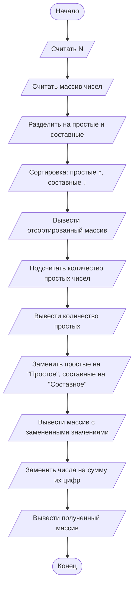

## Отчет по лабораторной работе № 2

#### № группы: `ПМ-2402`

#### Выполнил: `Павлов Максим Витальевич`

#### Вариант: `18`

### Cодержание:

- [Постановка задачи](#1-постановка-задачи)
- [Входные и выходные данные](#2-входные-и-выходные-данные)
- [Выбор структуры данных](#3-выбор-структуры-данных)
- [Алгоритм](#4-алгоритм)
- [Программа](#5-программа)
- [Анализ правильности решения](#6-анализ-правильности-решения)

### 1. Постановка задачи

> Напишите программу на Java, которая выполняет следующие действия с одномерным массивом натуральных чисел, включая проверку чисел на простоту:
> 1. Считывает с консоли число N, затем N целых чисел и заполняет массив размером N.
> 2. Переставляет элементы массива таким образом, чтобы сначала располагались все простые числа в порядке возрастания, затем все составные числа в порядке убывания. Если числа имеют одинаковый статус (оба простые или оба составные), сортирует их по соответствующему порядку.
> 3. Находит и выводит количество простых чисел в массиве.
> 4. Выводит элементы массива, заменяя простые числа на слово «Простое», а составные числа на слово «Составное».
> 5. Заменяет каждое число в массиве на сумму его цифр и выводит полученный массив.

Требуется написать программу, выполняющую ряд операций над одномерным массивом натуральных чисел. Она должна заполнять массив указанного размера, переставлять его элементы определенным образом, находить и выводить количество простых чисел массива, производить замену элементов массива (чисел) на слова и заменять числа в массиве на сумму их цифр. 

### 2. Входные и выходные данные

#### Данные на вход

На вход программа получает натуральное число N, затем N целых чисел.

|             | Тип                | min значение    | max значение   |
|-------------|--------------------|-----------------|----------------|
| N (Число 1) | Целое число        | 0               | 2<sup>31</sup> |


#### Данные на выход

На выходе мы получаем количество простых чисел в массиве (целое неотрицательное число), элементы массива, замененные на слова "Простое" или "Составное", а так же суммы цифр элементов массива.

|         | Тип                                | min значение | max значение   |
|---------|------------------------------------|--------------|----------------|
| Число 1 | Целое неотрицательное число        | 0            | 2<sup>31</sup> |
| Строка  | Строка                             | 7            | 9              |
| Число 2 | Целое неотрицательное число        | 0            | 2<sup>31</sup> |

### 3. Выбор структуры данных

Программа получает число N, N целых чисел и создает массив размером N, поэтому данные типа `int` будут храниться и обрабатываться в одномерном массиве `int[]`. 

### 4. Алгоритм

#### Алгоритм выполнения программы:

1. **Ввод данных:**  
   Программа считывает натуральное число `N`.

2. **Определение простых и составных чисел**  
   Программа проверяет каждый элемент массива на простоту, затем добавляет простые и составные числа в соответствующие массивы `prim` и `comp`.

3. **Сортировка массива**
   Программа сортирует массивы `prim` и `comp` по возрастанию и убыванию соответственно, после чего объединяет отсортированные массивы в один.
    

5. **Подсчет простых чисел**  
   Программа записывает размер массива - `prim` количество простых чисел.

6. **Замена чисел на слова**  
   Программа переносит элементы отсортированного массива в новый массив `String[]`.

7. **Замена чисел на сумму их цифр**  
   Программа считает сумму цифр для каждого числа в массиве.

5. **Вывод результатов**
   Программа выводит количество простых чисел, замененные на слова элементы массива и суммы цифр каждого элемента массива.
   
#### Блок-схема



### 5. Программа

```java
import java.io.PrintStream;
import java.util.Scanner;

public class Main {
    // Объявляем объект класса Scanner для ввода данных
    public static Scanner in = new Scanner(System.in);
    // Объявляем объект класса PrintStream для вывода данных
    public static PrintStream out = System.out;

    public static void main(String[] args) {
        // Считывание двух вещественных чисел x и y из консоли
        double x = in.nextDouble();
        double y = in.nextDouble();

        // Определение максимального числа
        if (x >= y) {
            // Если x положительное, выводим x, иначе выводим -x,
            // чтобы на выходе было его абсолютное значение
            if (x >= 0) {
                out.println(x);
            } else {
                out.println(-x);
            }
        } else {
            // Если x положительное, выводим y, иначе выводим -y,
            // чтобы на выходе было его абсолютное значение
            if (y >= 0) {
                out.println(y);
            } else {
                out.println(-y);
            }
        }
    }
}
```

### 6. Анализ правильности решения

Программа работает корректно на всем множестве решений с учетом ограничений.

1. Тест на `X > Y > 0`:

    - **Input**:
        ```
        5 1.3
        ```

    - **Output**:
        ```
        5
        ```

2. Тест на `X < Y < 0`:

    - **Input**:
        ```
        -4 -2.2
        ```

    - **Output**:
        ```
        2.2
        ```

3. Тест на `X < 0 < Y`:

    - **Input**:
        ```
        -4 5
        ```

    - **Output**:
        ```
        5
        ```

4. Тест на `X = 0` или `Y = 0`:

    - **Input**:
        ```
        0 -3
        ```

    - **Output**:
        ```
        3
        ```

5. Тест на ограничение задачи:

    - **Input**:
        ```
        -1000000000 1000000000
        ```

    - **Output**:
        ```
        1000000000
        ```
